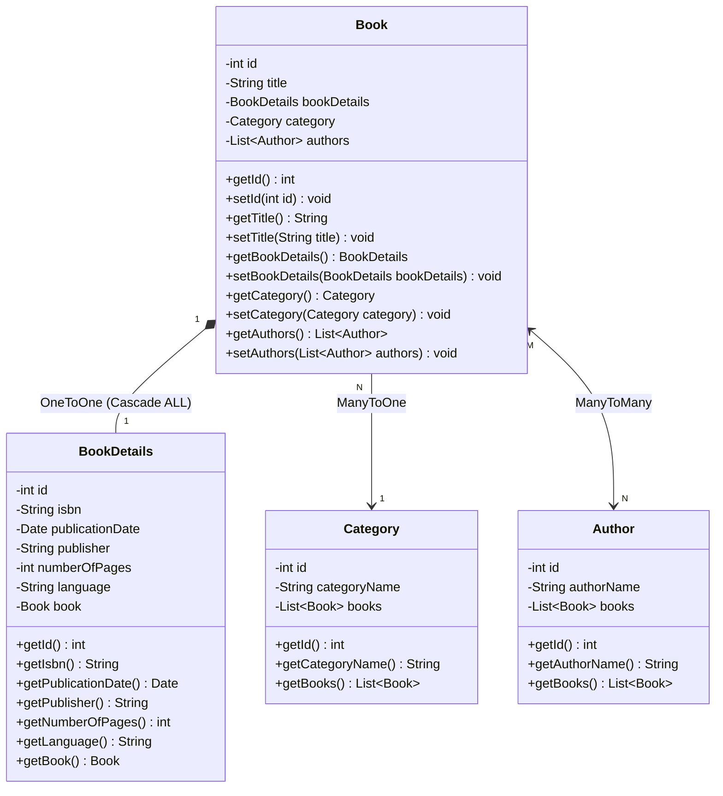
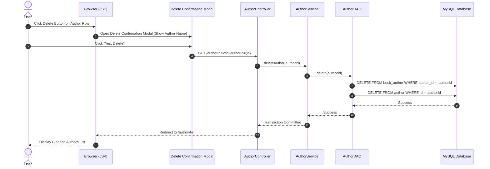

# 📚 Amazon Book Store - Enterprise Spring MVC & Hibernate CRUD Application

An enterprise-grade, full-stack Book Inventory Management Web Application built with **Spring MVC 4**, **Hibernate 4 ORM**, **MySQL 8**, **JSP / JSTL**, and **Bootstrap 5**.

---

## 🌟 Features Overview

- **📖 Book Inventory Management (Full CRUD):**
  - **Browse Inventory:** Responsive table showing Book Title, Category badge, Author badges, ISBN, and action controls.
  - **Quick Details Modal:** Instant preview modal popup for publication details (Publisher, Date, Pages, Language) without full page reload.
  - **Dedicated `viewMore` Page:** Dedicated full-page view showing comprehensive book metadata and publication information (`/book/viewMore?bookId={id}`).
  - **Add & Update Books:** Robust form with real-time feedback and dynamic category & author binding.
  - **Custom Delete Confirmation:** Sleek Bootstrap 5 modal warning before permanent removal.

- **🏷️ Category Management (Many-to-One):**
  - Dedicated category management (`/category/list`).
  - Add, update, and delete categories with unique name validation.
  - Safe unlinking of books on category deletion (`category_id = NULL`) to prevent orphaned books or constraint failures.

- **✍️ Author Directory (Many-to-Many):**
  - Dedicated author directory (`/author/list`).
  - Add, update, and delete authors with unique name validation.
  - Assign multiple authors per book via checkboxes mapped to the `book_author` join table.
  - Safe deletion of authors by clearing join table mappings first.

- **📄 Publication Details (One-to-One with `CascadeType.ALL`):**
  - Track ISBN, Publisher, Publication Date (`java.util.Date`), Number of Pages, and Language.
  - Automatic persistence and lifecycle cascading.

- **🔍 Real-Time Live Search (All Screens):**
  - Instant client-side search and filtering across **Books** (by Title, Category, Author, ISBN), **Categories**, and **Authors** with live counter and clear button.

- **🌐 Interactive Draggable Language Selector:**
  - HTML5 Drag-and-Drop language chips to easily assign book language with visual dropzone feedback.

- **🌙 Dark & Light Themes (Persistent):**
  - Top navigation theme switcher toggle with `localStorage` persistence and smooth color transitions.

- **🛡️ Full-Stack Validation & Data Integrity:**
  - **Frontend:** HTML5 required attributes + JavaScript submit-time validation for Title, Category, at least 1 Author, mandatory Language, and ISBN format.
  - **Backend:** Spring MVC Controller validation with customized error alerts and model preservation.
  - **Uniqueness Checks:** Unique ISBN enforcement for books, unique Category names, and unique Author names.

---

## 🛠️ Technologies & Stack

| Layer | Technology |
| :--- | :--- |
| **Backend Framework** | Spring Framework `4.3.30.RELEASE` (Spring MVC, Spring ORM, Spring Tx) |
| **ORM / Persistence** | Hibernate ORM `4.3.8.Final`, JPA 2.1 Annotations |
| **Bean Validation** | Hibernate Validator `5.4.3.Final` (JSR-303) |
| **Database** | MySQL 8.0 with MySQL Connector `8.0.33` |
| **Connection Pool** | C3P0 `ComboPooledDataSource` |
| **Frontend / Views** | JSP 2.1, JSTL 1.2, HTML5, CSS3, JavaScript |
| **UI Framework** | Bootstrap `5.3.0` & Bootstrap Icons `1.11.0` |
| **Servlet Container** | Apache Tomcat 9 |
| **Build Tool** | Apache Maven 3 |

---

## 🏛️ Architecture & Database Design

### Entity Relationships:
1. **`Book` ⟷ `BookDetails`:** `@OneToOne(mappedBy = "book", cascade = CascadeType.ALL)`
2. **`Book` ⟷ `Category`:** `@ManyToOne` with `@JoinColumn(name = "category_id")`
3. **`Book` ⟷ `Author`:** `@ManyToMany` with `@JoinTable(name = "book_author")`

```
  ┌──────────────┐         1:1 (Cascade ALL)         ┌──────────────────┐
  │     Book     │ ───────────────────────────────── │   BookDetails    │
  │──────────────│                                   │──────────────────│
  │ id (PK)      │                                   │ id (PK)          │
  │ title        │                                   │ isbn (UQ)        │
  │ category_id  │                                   │ publication_date │
  └──────────────┘                                   │ publisher        │
         │                                           │ number_of_pages  │
         │ N:1 (SET NULL on delete)                  │ language         │
         ▼                                           │ book_id (FK, UQ) │
  ┌──────────────┐                                   └──────────────────┘
  │   Category   │
  │──────────────│
  │ id (PK)      │
  │ category_name│ (UQ)
  └──────────────┘
         
         ▲
         │ N:M (Join Table: book_author, CASCADE on delete)
         ▼
  ┌──────────────┐
  │    Author    │
  │──────────────│
  │ id (PK)      │
  │ author_name  │ (UQ)
  └──────────────┘
```

---

## 📐 UML Class Diagram



---

## 🔄 Sequence Diagrams

### 1. Create New Book Workflow


### 2. Safe Author Deletion Workflow


---

## 🚀 How to Run the Project

### 1. Prerequisites
- **Java JDK 8 or higher**
- **Apache Maven 3.6+**
- **Apache Tomcat 9.0+**
- **MySQL Server 8.0+**

### 2. Database Setup & Initialization
1. Start MySQL Server.
2. Run the complete initialization script in `Query.sql`:
```sql
CREATE DATABASE IF NOT EXISTS amazon_book_store;
USE amazon_book_store;

SET FOREIGN_KEY_CHECKS = 0;
TRUNCATE TABLE book_author;
TRUNCATE TABLE book_details;
TRUNCATE TABLE book;
TRUNCATE TABLE category;
TRUNCATE TABLE author;
SET FOREIGN_KEY_CHECKS = 1;

-- Insert Categories
INSERT INTO category (id, category_name) VALUES 
(1, 'Computer Science & Programming'),
(2, 'Software Engineering & Architecture'),
(3, 'Science Fiction & Fantasy'),
(4, 'History & Biography'),
(5, 'Business & Economics'),
(6, 'Self-Development & Psychology');

-- Insert Authors
INSERT INTO author (id, author_name) VALUES 
(1, 'Robert C. Martin'),
(2, 'Martin Fowler'),
(3, 'Joshua Bloch'),
(4, 'Eric Evans'),
(5, 'George Orwell'),
(6, 'J.K. Rowling'),
(7, 'James Clear');

-- Insert Books
INSERT INTO book (id, title, category_id) VALUES 
(1, 'Clean Code: A Handbook of Agile Software Craftsmanship', 1),
(2, 'Refactoring: Improving the Design of Existing Code', 2),
(3, 'Effective Java', 1),
(4, 'Domain-Driven Design: Tackling Complexity in the Heart of Software', 2),
(5, '1984', 3),
(6, 'Atomic Habits', 6);

-- Insert Book Details (One-to-One)
INSERT INTO book_details (id, isbn, publisher, publication_date, number_of_pages, language, book_id) VALUES 
(1, '978-0132350884', 'Prentice Hall', '2008-08-01', 464, 'English', 1),
(2, '978-0134757599', 'Addison-Wesley Professional', '2018-11-30', 448, 'English', 2),
(3, '978-0134685991', 'Addison-Wesley Professional', '2017-12-27', 412, 'English', 3),
(4, '978-0321125217', 'Addison-Wesley Professional', '2003-08-30', 560, 'English', 4),
(5, '978-0451524935', 'Signet Classic', '1950-07-01', 328, 'English', 5),
(6, '978-0735211292', 'Avery', '2018-10-16', 320, 'English', 6);

-- Map Books to Authors
INSERT INTO book_author (book_id, author_id) VALUES 
(1, 1), (2, 2), (3, 3), (4, 4), (5, 5), (6, 7);
```

3. Update database credentials in `src/main/resources/database.properties` if needed:
```properties
db.driver=com.mysql.cj.jdbc.Driver
db.url=jdbc:mysql://localhost:3306/amazon_book_store?useSSL=false&serverTimezone=UTC&allowPublicKeyRetrieval=true
db.user=root
db.password=root
```

### 3. Deploy on Apache Tomcat 9
1. In IntelliJ IDEA / Eclipse:
   - Configure **Smart Tomcat** or **Tomcat Server (Local)**.
   - Set **Deployment Directory** to `src/main/webapp` (or artifact `amazon-book-store:war exploded`).
   - Set **Context Path** to `/amazon-book-store`.
2. Start Tomcat Server.
3. Open your browser:
   - **Home Dashboard:** `http://localhost:8080/amazon-book-store/`
   - **Books Inventory:** `http://localhost:8080/amazon-book-store/book/list`
   - **Categories:** `http://localhost:8080/amazon-book-store/category/list`
   - **Authors:** `http://localhost:8080/amazon-book-store/author/list`

---

## 📌 Application Endpoints Reference

| HTTP Method | URL Pattern | Description |
| :--- | :--- | :--- |
| `GET` | `/` | Home Landing Page & Live Statistics Dashboard |
| `GET` | `/book/list` | Display Books Inventory with Live Search & Modals |
| `GET` | `/book/showFormForAdd` | Show form to add a new Book |
| `POST` | `/book/saveBook` | Handle Add / Update Book submission with full validation |
| `GET` | `/book/showFormForUpdate?bookId={id}` | Show form populated with existing Book data |
| `GET` | `/book/viewMore?bookId={id}` | Dedicated View More full details page |
| `GET` | `/book/delete?bookId={id}` | Safely delete a Book and its details |
| `GET` | `/category/list` | List all Categories with Live Search |
| `GET` | `/category/showFormForAdd` | Show form to add Category |
| `POST` | `/category/saveCategory` | Save new or updated Category with duplicate check |
| `GET` | `/category/showFormForUpdate?categoryId={id}` | Show form to edit Category |
| `GET` | `/category/delete?categoryId={id}` | Safely delete Category and unlink books |
| `GET` | `/author/list` | List all Authors with Live Search |
| `GET` | `/author/showFormForAdd` | Show form to add Author |
| `POST` | `/author/saveAuthor` | Save new or updated Author with duplicate check |
| `GET` | `/author/showFormForUpdate?authorId={id}` | Show form to edit Author |
| `GET` | `/author/delete?authorId={id}` | Safely delete Author and clean join table |

---

## 👨‍💻 Project Structure

```
amazon-book-store/
├── pom.xml
├── Query.sql
├── README.md
└── src/
    └── main/
        ├── java/com/bootcamp/bookstore/
        │   ├── AmazonBookStore.java
        │   ├── controller/
        │   │   ├── HomeController.java
        │   │   ├── BookController.java
        │   │   ├── CategoryController.java
        │   │   └── AuthorController.java
        │   ├── dao/
        │   │   ├── BookDAO.java & BookDAOImpl.java
        │   │   ├── CategoryDAO.java & CategoryDAOImpl.java
        │   │   └── AuthorDAO.java & AuthorDAOImpl.java
        │   ├── service/
        │   │   ├── BookService.java & BookServiceImpl.java
        │   │   ├── CategoryService.java & CategoryServiceImpl.java
        │   │   └── AuthorService.java & AuthorServiceImpl.java
        │   └── model/
        │       ├── Book.java
        │       ├── BookDetails.java
        │       ├── Category.java
        │       └── Author.java
        ├── resources/
        │   ├── application-context.xml
        │   └── database.properties
        └── webapp/
            ├── resources/css/style.css
            └── WEB-INF/
                ├── web.xml
                └── view/
                    ├── home.jsp
                    ├── list-books.jsp
                    ├── viewMore.jsp
                    ├── book-form.jsp
                    ├── list-categories.jsp
                    ├── category-form.jsp
                    ├── list-authors.jsp
                    └── author-form.jsp
```
